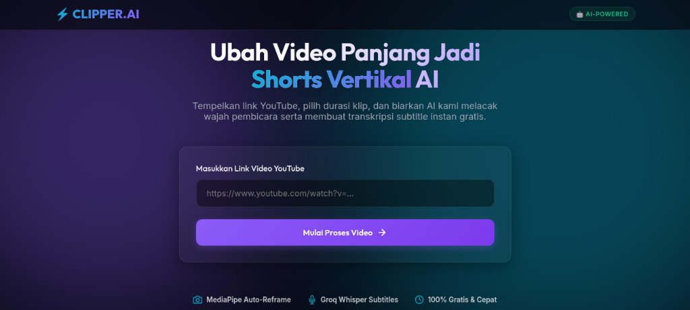
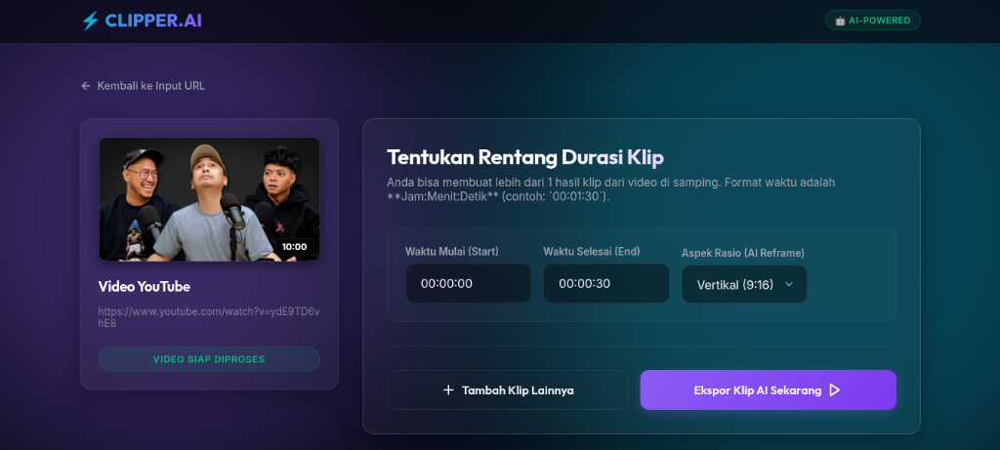
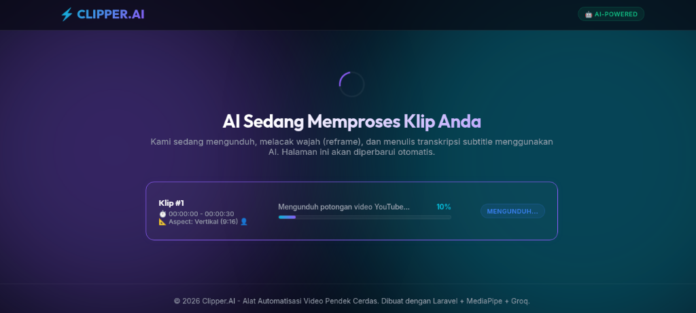
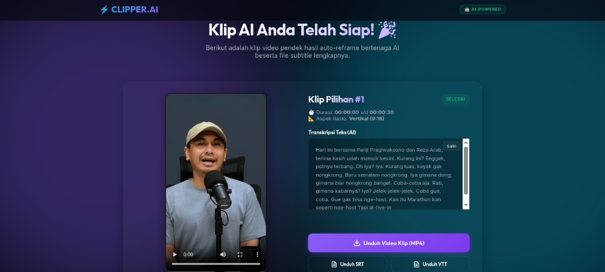
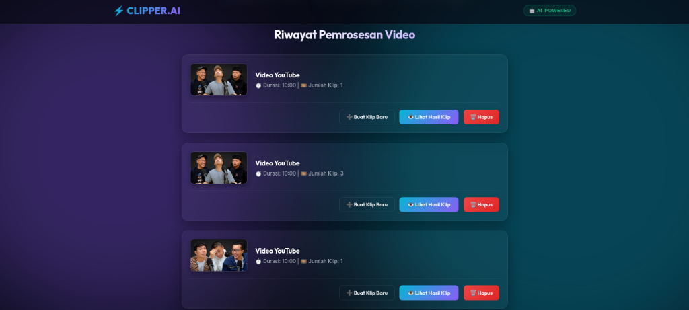

<p align="center">
  <h1 align="center">🎬 Clipper.AI</h1>
  <p align="center">
    <strong>Platform Otomasi Pembuatan Video Pendek Cerdas Berbasis AI</strong>
  </p>
  <p align="center">
    Ubah video YouTube panjang menjadi klip pendek siap posting dengan face tracking otomatis &amp; subtitle instan.
  </p>
  <p align="center">
    <a href="#fitur-utama">Fitur</a> •
    <a href="#arsitektur-sistem">Arsitektur</a> •
    <a href="#persyaratan-sistem">Persyaratan</a> •
    <a href="#instalasi">Instalasi</a> •
    <a href="#cara-penggunaan">Penggunaan</a> •
    <a href="#tech-stack">Tech Stack</a>
  </p>
</p>

---

## 📖 Tentang Proyek

**Clipper.AI** adalah platform web otomasi berbasis AI yang mengubah video YouTube panjang menjadi klip pendek vertikal (9:16) maupun horizontal (16:9) yang siap diposting ke platform seperti **YouTube Shorts, Instagram Reels, dan TikTok**.

Cukup masukkan link YouTube, tentukan timestamp klip yang diinginkan, dan biarkan AI menangani sisanya — mulai dari **face tracking & auto-reframe** hingga **pembuatan subtitle otomatis**.

### Alur Kerja

```
Link YouTube → Pilih Timestamp → AI Proses Otomatis → Download Video + Subtitle
```

1. **Paste link YouTube** — Sistem otomatis mengambil judul, thumbnail, dan durasi video.
2. **Tentukan timestamp** — Pilih satu atau lebih segment waktu yang ingin diklip beserta aspect ratio-nya.
3. **AI memproses otomatis** — Download segment, face tracking & auto-reframe, generate subtitle.
4. **Download hasil** — Video klip (.mp4) dan file subtitle (.srt) siap diunduh.

---

## 🖼️ Demo / Tampilan Aplikasi

Berikut adalah tampilan antarmuka (UI/UX) modern premium dari **Clipper.AI** yang menggunakan tema *dark mode* dan efek *glassmorphism*:

### 1. Dashboard (Landing Page)
*Halaman utama minimalis untuk memasukkan link video YouTube.*


### 2. Panel Pemilihan Klip (Clip Selector)
*Panel interaktif untuk menentukan durasi waktu klip (start/end) dan orientasi aspek rasio (Vertikal 9:16 atau Horizontal 16:9).*


### 3. Pemantau Progress Real-Time (Processing Page)
*Halaman pemantau progress pemrosesan video yang di-update secara otomatis.*


### 4. Hasil & Unduhan (Results Page)
*Halaman akhir untuk memutar hasil klip secara instan, menyalin teks transkripsi AI sekali-klik, dan mengunduh video (.mp4) beserta subtitle (.srt / .vtt).*


### 5. Riwayat Tugas & Debug Console (History Page)
*Panel dashboard manajemen riwayat untuk memantau status tugas, menghapus tugas/tugas yang gagal, dan melihat log debug konsol pemrosesan.*


---

## ✨ Fitur Utama

### 🎯 Smart Clip Extraction
- Input link YouTube, sistem otomatis mengambil metadata video (judul, thumbnail, durasi).
- Tentukan **banyak klip sekaligus** dari satu video dengan timestamp berbeda.
- Pilih output **Vertikal (9:16)** untuk Shorts/Reels/TikTok atau **Horizontal (16:9)** untuk format standar.

### 👤 AI Face Tracking & Auto-Reframe
- Menggunakan **OpenCV Haar Cascade** untuk deteksi wajah secara real-time.
- **Exponential Moving Average (EMA) smoothing** untuk pergerakan kamera yang halus dan sinematik.
- Otomatis melakukan crop dan reframe ke format vertikal 9:16 dengan wajah pembicara selalu berada di tengah frame.
- Optimasi performa: deteksi wajah setiap 3 frame untuk kecepatan rendering tinggi.

### 📝 Auto-Subtitle Generation
- Transkripsi audio menggunakan **Groq Cloud API** (Whisper Large V3) — gratis dan super cepat (1–2 detik).
- Menghasilkan file subtitle **format .srt** yang siap digunakan.
- Mendukung berbagai bahasa secara otomatis (auto-detect language).

### 📊 Real-Time Progress Monitoring
- Pantau status pemrosesan setiap klip secara real-time dengan progress bar.
- Status update live: downloading → face tracking → transcribing → completed.
- Debug console bawaan untuk melihat log proses secara detail.

### 🗂️ Manajemen Tugas
- Lihat riwayat semua video dan klip yang pernah diproses.
- Hapus tugas yang gagal atau yang sudah selesai didownload.
- Status indikator visual: pending, processing, completed, failed.

### 🎨 UI/UX Premium
- Desain modern dengan glassmorphism, gradient, dan micro-animations.
- Dark mode theme yang elegan dan nyaman di mata.
- Fully responsive — berfungsi baik di desktop maupun mobile.

---

## 🏗️ Arsitektur Sistem

```
┌─────────────────────────────────────────────────────────────┐
│                     BROWSER (Frontend)                      │
│          Laravel Blade + Vite + Vanilla CSS                 │
│                                                             │
│  Dashboard → Clip Selector → Processing → Results Page      │
└─────────────────────┬───────────────────────────────────────┘
                      │ HTTP / AJAX Polling
┌─────────────────────▼───────────────────────────────────────┐
│                  LARAVEL BACKEND (PHP)                       │
│                                                             │
│  VideoController ──→ ProcessVideoClipJob (Queue)            │
│       │                      │                              │
│  Video Model            Clip Model                          │
│  (videos table)         (clips table)                       │
└──────────────────────────┬──────────────────────────────────┘
                           │ Symfony Process (subprocess)
┌──────────────────────────▼──────────────────────────────────┐
│               PYTHON AI PIPELINE                            │
│                                                             │
│  clipper_bot.py (Orchestrator)                              │
│       │                                                     │
│       ├── yt-dlp          → Download segment YouTube        │
│       ├── face_tracker.py → OpenCV face tracking & crop     │
│       └── transcribe.py   → Groq API (Whisper) → .srt      │
└─────────────────────────────────────────────────────────────┘
```

---

## 📋 Persyaratan Sistem

### Software Wajib

| Software | Versi Minimum | Keterangan |
|----------|---------------|------------|
| **PHP** | 8.3+ | Runtime Laravel |
| **Composer** | 2.x | PHP dependency manager |
| **Node.js** | 18+ | Build frontend assets (Vite) |
| **NPM** | 9+ | Node package manager |
| **Python** | 3.10+ | AI pipeline scripts |
| **FFmpeg** | 6.0+ | Video processing & transcoding |
| **SQLite** | 3.x | Database (default, bisa diganti MySQL/PostgreSQL) |

### API Key (Gratis)

| Layanan | Kegunaan | Link |
|---------|----------|------|
| **Groq API** | Transkripsi Whisper (speech-to-text) | [console.groq.com/keys](https://console.groq.com/keys) |

> **Catatan**: Groq API sepenuhnya **gratis** dengan limit sangat besar. Cukup daftar akun dan generate API key.

---

## 🚀 Instalasi

### Langkah 1: Clone Repository

```bash
git clone https://github.com/dapaaa07/ai-clipper.git
cd ai-clipper
```

### Langkah 2: Install Dependensi PHP (Composer)

```bash
composer install
```

### Langkah 3: Konfigurasi Environment

```bash
# Salin file environment template
cp .env.example .env

# Generate application key
php artisan key:generate
```

Edit file `.env` dan sesuaikan konfigurasi berikut:

```env
# Nama aplikasi
APP_NAME="Clipper.AI"

# Database (default SQLite, tidak perlu diubah)
DB_CONNECTION=sqlite

# Queue driver (wajib database untuk job processing)
QUEUE_CONNECTION=database

# Groq API Key (dapatkan gratis di https://console.groq.com/keys)
GROQ_API_KEY=gsk_YOUR_API_KEY_HERE
```

### Langkah 4: Setup Database

```bash
# Buat file database SQLite
touch database/database.sqlite

# Jalankan migrasi untuk membuat tabel
php artisan migrate
```

### Langkah 5: Buat Storage Link

```bash
php artisan storage:link
```

### Langkah 6: Setup Python Virtual Environment

```bash
# Buat virtual environment Python
python3 -m venv python_venv

# Aktifkan virtual environment
source python_venv/bin/activate

# Install dependensi Python
pip install -r app/PythonScripts/requirements.txt

# Deaktifkan virtual environment
deactivate
```

### Langkah 7: Install & Verifikasi FFmpeg

```bash
# Ubuntu/Debian
sudo apt update && sudo apt install ffmpeg -y

# Verifikasi instalasi
ffmpeg -version
```

### Langkah 8: Install Dependensi Frontend (Node.js)

```bash
npm install
```

### Langkah 9: Build Assets Frontend

```bash
# Untuk development (dengan hot reload)
npm run dev

# Untuk production
npm run build
```

### Langkah 10: Jalankan Aplikasi

Anda perlu menjalankan **3 proses secara bersamaan** di terminal terpisah:

**Terminal 1 — Laravel Development Server:**
```bash
php artisan serve
```

**Terminal 2 — Queue Worker (untuk memproses video di background):**
```bash
php artisan queue:work --timeout=1800 --tries=1 --memory=512
```

**Terminal 3 — Vite Dev Server (untuk hot reload frontend):**
```bash
npm run dev
```

> **💡 Alternatif**: Jalankan semuanya sekaligus dengan satu perintah:
> ```bash
> composer dev
> ```

Buka browser dan akses: **http://localhost:8000**

---

## 📖 Cara Penggunaan

### 1. Masukkan Link YouTube
- Buka halaman utama (`http://localhost:8000`).
- Paste URL video YouTube yang ingin di-clip pada kolom input.
- Klik tombol **"Analisis Video"** — sistem akan mengambil informasi video secara otomatis.

### 2. Tentukan Timestamp Klip
- Atur **waktu mulai** dan **waktu selesai** untuk setiap klip yang diinginkan.
- Pilih **aspect ratio**: Vertikal (9:16) untuk Shorts/Reels/TikTok atau Horizontal (16:9).
- Anda bisa menambahkan **banyak klip sekaligus** dari satu video.

### 3. Mulai Proses
- Klik tombol **"Ekspor Klip Sekarang"** untuk memulai pemrosesan.
- Pantau progress setiap klip secara real-time:
  - 📥 **Downloading** (0–20%) — Mengunduh segment video dari YouTube.
  - 👤 **Face Tracking** (20–55%) — AI mendeteksi wajah dan melakukan auto-reframe.
  - 📝 **Transcribing** (55–90%) — AI mentranskripsi audio menjadi subtitle.
  - ✅ **Completed** (100%) — Klip siap didownload.

### 4. Download Hasil
- Setelah semua klip selesai diproses, klik **"Lihat Hasil"**.
- Download file video klip (`.mp4`) dan subtitle (`.srt`) yang dihasilkan.

---

## 📁 Struktur Proyek

```
ai-clipper/
├── app/
│   ├── Http/Controllers/
│   │   └── VideoController.php      # Controller utama (parse, clip, status)
│   ├── Jobs/
│   │   └── ProcessVideoClipJob.php  # Queue job untuk processing video
│   ├── Models/
│   │   ├── Video.php                # Model video (youtube_url, title, dll)
│   │   └── Clip.php                 # Model klip (timestamp, status, progress)
│   └── PythonScripts/
│       ├── clipper_bot.py           # Orchestrator utama pipeline AI
│       ├── face_tracker.py          # OpenCV face tracking & auto-reframe
│       ├── transcribe.py            # Groq API Whisper transcription
│       └── requirements.txt         # Dependensi Python
├── database/
│   └── migrations/
│       ├── create_videos_table.php   # Skema tabel videos
│       └── create_clips_table.php    # Skema tabel clips
├── resources/
│   └── views/
│       ├── dashboard.blade.php      # Halaman utama (input URL)
│       ├── clip_selector.blade.php  # Halaman pilih timestamp & aspect ratio
│       ├── processing.blade.php     # Halaman monitoring progress real-time
│       └── results.blade.php        # Halaman download hasil
├── routes/
│   └── web.php                      # Definisi routes
├── python_venv/                     # Python virtual environment (gitignored)
├── .env.example                     # Template konfigurasi environment
├── composer.json                    # Dependensi PHP
├── package.json                     # Dependensi Node.js
└── vite.config.js                   # Konfigurasi Vite bundler
```

---

## 🛠️ Tech Stack

### Backend
| Teknologi | Kegunaan |
|-----------|----------|
| **Laravel 13** | Framework PHP utama (routing, MVC, queue jobs) |
| **SQLite** | Database ringan (bisa diganti MySQL/PostgreSQL) |
| **Laravel Queue** | Background job processing untuk video pipeline |

### Frontend
| Teknologi | Kegunaan |
|-----------|----------|
| **Laravel Blade** | Template engine server-side |
| **Vite** | Frontend build tool & HMR |
| **Vanilla CSS** | Styling premium (glassmorphism, gradient, animations) |

### AI & Video Processing
| Teknologi | Kegunaan |
|-----------|----------|
| **Python 3** | Runtime untuk AI pipeline scripts |
| **OpenCV** | Face detection (Haar Cascade) & video frame processing |
| **yt-dlp** | Download video segment dari YouTube |
| **FFmpeg** | Video transcoding, cutting, audio merging |
| **Groq API** | Cloud inference Whisper Large V3 (speech-to-text, gratis) |

---

## ⚙️ Konfigurasi Lanjutan

### Mengganti Database ke MySQL

Edit file `.env`:

```env
DB_CONNECTION=mysql
DB_HOST=127.0.0.1
DB_PORT=3306
DB_DATABASE=ai_clipper
DB_USERNAME=root
DB_PASSWORD=your_password
```

Lalu jalankan migrasi ulang:

```bash
php artisan migrate:fresh
```

### Queue Worker untuk Production

Untuk environment production, disarankan menggunakan **Supervisor** agar queue worker selalu berjalan:

```ini
# /etc/supervisor/conf.d/ai-clipper-worker.conf

[program:ai-clipper-worker]
process_name=%(program_name)s_%(process_num)02d
command=php /path/to/ai-clipper/artisan queue:work --timeout=1800 --tries=1 --memory=512
autostart=true
autorestart=true
stopasgroup=true
killasgroup=true
user=www-data
numprocs=1
redirect_stderr=true
stdout_logfile=/path/to/ai-clipper/storage/logs/worker.log
stopwaitsecs=3600
```

```bash
sudo supervisorctl reread
sudo supervisorctl update
sudo supervisorctl start ai-clipper-worker:*
```

---

## 🐛 Troubleshooting

### Job gagal setelah 1 menit
Queue worker memiliki timeout default 60 detik. Pastikan menjalankan dengan flag `--timeout=1800`:
```bash
php artisan queue:work --timeout=1800 --tries=1
```

### Video tidak bisa di-crop (0 frames processed)
Video YouTube kemungkinan dalam codec AV1 yang tidak didukung OpenCV. Sistem sudah memiliki auto-transcode ke H.264, tetapi pastikan FFmpeg terinstall dengan benar:
```bash
ffmpeg -codecs | grep libx264
```

### yt-dlp tidak ditemukan
Pastikan yt-dlp terinstall di dalam Python virtual environment:
```bash
source python_venv/bin/activate
pip install yt-dlp
deactivate
```

### Groq API error
Pastikan API key valid di file `.env`. Dapatkan key gratis di [console.groq.com/keys](https://console.groq.com/keys).

---

## 📄 Lisensi

Proyek ini dilisensikan di bawah [MIT License](LICENSE).

---

<p align="center">
  Dibuat dengan ❤️ menggunakan <strong>Laravel + Python + OpenCV + Groq AI</strong>
</p>
# Cliper-AI
